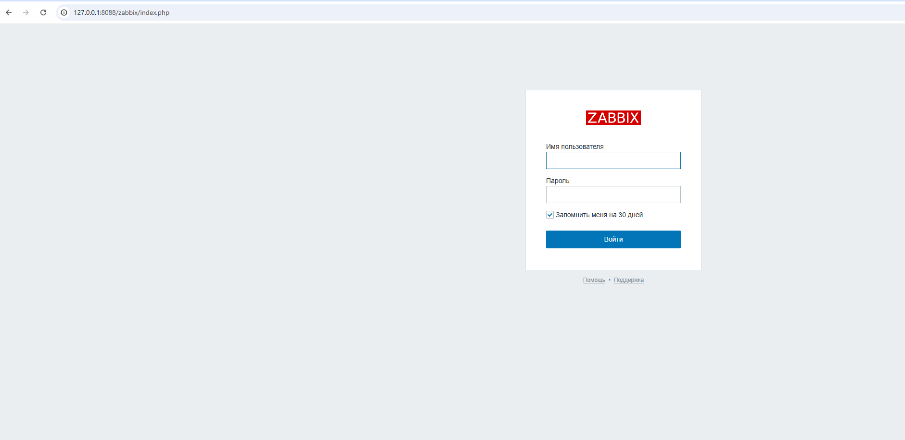
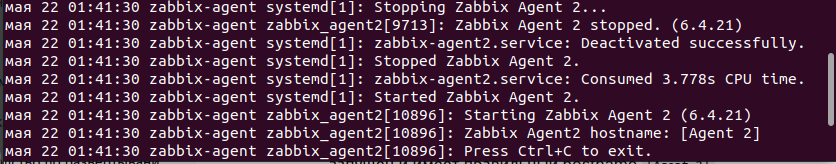
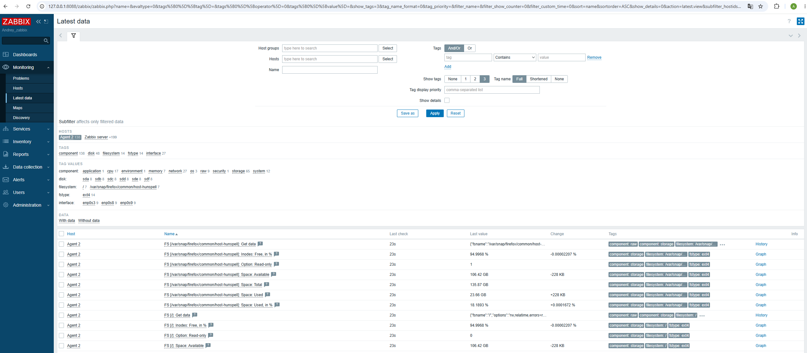

# Домашнее задание: Установка Zabbix Server с веб-интерфейсом

**Студент:** [Андрей]  
**Дата выполнения:** 21.05.2026

## Результат

Скриншот страницы авторизации в веб-интерфейсе Zabbix (после успешного входа):



## Использованные команды

### Установка PostgreSQL
```bash
sudo apt update && sudo apt upgrade -y
sudo apt install -y postgresql postgresql-contrib
sudo systemctl enable --now postgresql

Добавление репозитория Zabbix 6.4 (Ubuntu 22.04)
bash
wget https://repo.zabbix.com/zabbix/6.4/ubuntu/pool/main/z/zabbix-release/zabbix-release_6.4-1+ubuntu22.04_all.deb
sudo dpkg -i zabbix-release_6.4-1+ubuntu22.04_all.deb
sudo apt update
Установка Zabbix сервера, веб-интерфейса и агента
bash
sudo apt install -y zabbix-server-pgsql zabbix-frontend-php php8.1-pgsql zabbix-apache-conf zabbix-sql-scripts zabbix-agent2
Создание базы данных и пользователя PostgreSQL
bash
sudo -u postgres createuser --pwprompt zabbix
sudo -u postgres createdb -O zabbix zabbix
Импорт схемы базы данных
bash
zcat /usr/share/zabbix-sql-scripts/postgresql/server.sql.gz | sudo -u zabbix psql zabbix
Настройка пароля в конфигурации Zabbix сервера
bash
sudo nano /etc/zabbix/zabbix_server.conf
Настройка Apache (порт 8088, отключение nginx)
bash
sudo systemctl stop nginx
sudo systemctl disable nginx
sudo sed -i 's/Listen 80/Listen 8088/' /etc/apache2/ports.conf
sudo sed -i 's/VirtualHost \*:80/VirtualHost \*:8088/' /etc/apache2/sites-available/000-default.conf
Установка PHP модуля для Apache
bash
sudo apt install -y libapache2-mod-php8.1 php8.1
sudo a2enmod php8.1
Создание конфигурации Zabbix для Apache
bash
sudo tee /etc/apache2/conf-available/zabbix.conf > /dev/null <<EOF
Alias /zabbix /usr/share/zabbix
<Directory "/usr/share/zabbix">
    Options FollowSymLinks
    AllowOverride None
    Require all granted
</Directory>
<IfModule mod_php.c>
    php_value max_execution_time 300
    php_value memory_limit 128M
    php_value post_max_size 16M
    php_value upload_max_filesize 2M
    php_value max_input_time 300
    php_value max_input_vars 10000
    php_value date.timezone Europe/Moscow
</IfModule>
EOF
sudo a2enconf zabbix
Запуск служб
bash
sudo systemctl restart zabbix-server zabbix-agent2 apache2
sudo systemctl enable zabbix-server zabbix-agent2 apache2
Проброс портов в VirtualBox
В настройках виртуальной машины (NAT) добавлено правило:

Порт хоста: 8088 → Порт гостя: 8088 (TCP)

Доступ к веб-интерфейсу
http://127.0.0.1:8088/zabbix


## Задание 2: Установка Zabbix Agent на два хоста

### Результаты

Скриншот раздела Configuration → Hosts (оба хоста с зелёным ZBX)


Скриншот лога Zabbix Agent на клоне



Скриншот раздела Monitoring → Latest data для хоста Agent 2



### Использованные команды

#### На сервере (Zabbix Server / localhost)
bash
sudo apt install -y zabbix-agent2
sudo nano /etc/zabbix/zabbix_agent2.conf   # Server=127.0.0.1, Hostname=Zabbix server
sudo systemctl restart zabbix-agent2
sudo systemctl enable zabbix-agent2

На клоне (Agent 2)
bash
sudo apt install -y zabbix-agent2
sudo nano /etc/zabbix/zabbix_agent2.conf   # Server=<IP_сервера>, Hostname=Agent 2
sudo systemctl restart zabbix-agent2
sudo systemctl enable zabbix-agent2
